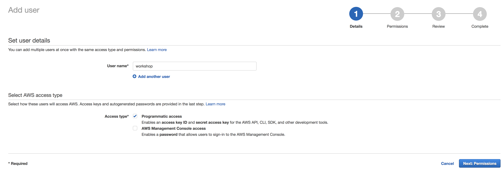
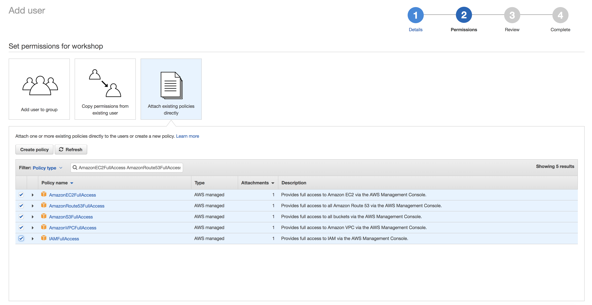

= Kubernetes Workshop Prereqs
:toc:

Here are the pre-requisites for the link:readme.adoc[Kubernetes on AWS workshop]:

== Windows 10 Linux Subsystem

This pre-requisite is only if you are using Windows 10.

Install Windows 10 Linux subsystem as explained at https://msdn.microsoft.com/en-us/commandline/wsl/install_guide.

The lab has been tested with Windows 10. A similar Unix shell on other Windows machines may work.

== AWS Account

You will be using an AWS Account while you go through the workshop. link:http://docs.aws.amazon.com/AmazonSimpleDB/latest/DeveloperGuide/AboutAWSAccounts.html[Create an AWS Account] if you don't already have one.

== AWS CLI

Install the latest version of http://docs.aws.amazon.com/cli/latest/userguide/installing.html[AWS CLI]
on your machine.

== AWS IAM Permissions

If you already have an AWS Account, you need to create an IAM user here: https://console.aws.amazon.com/iam/home?#/users$new
Just give it a useful name (e.g. `workshop`) and make sure you check the `Programmatic access` box:



In the next screen select `Attach existing policies directly` and search for `AmazonEC2FullAccess AmazonRoute53FullAccess AmazonS3FullAccess IAMFullAccess AmazonVPCFullAccess` - it will now show the roles needed: http://docs.aws.amazon.com/IAM/latest/UserGuide/reference_policies.html[IAM policies]



Check all five and hit next.

Please review this link:https://github.com/kubernetes/kops/blob/master/docs/aws.md#setup-iam-user[link]
for additional info on IAM permissions

== Configure the AWS CLI

In order to use the AWS CLI, you can configure it with `aws configure` on your commandline:
```
aws configure
AWS Access Key ID [None]: YOUR_IAM_ACCESS_KEY_ID
AWS Secret Access Key [None]: YOUR_IAM_SECRET_ACCESS_KEY
Default region name [None]: eu-central-1
Default output format [None]:
```

== AWS Availability Zones

Different availability zones for this region can be set in the environment variable `AWS_AVAILABILITY_ZONES` using the following command:

    AWS_AVAILABILITY_ZONES="$(aws ec2 describe-availability-zones --query 'AvailabilityZones[].ZoneName' --output text | awk -v OFS="," '$1=$1')"

Echo the value of the environment variable to confirm:

    echo $AWS_AVAILABILITY_ZONES
    eu-central-1a,eu-central-1b,eu-central-1c

Several parts of the workshop require the region or availability zones to be explicitly specified as a CLI option. The environment variable `$AWS_DEFAULT_REGION` is used to set the region. The environment variable `$AWS_AVAILABILITY_ZONES` is used to set the availability zones.

== Clone the repo

The workshop repo has configuration files that are used to create Kubernetes resources. You need to clone the repo to have access to those files:

	$ git clone https://github.com/arun-gupta/kubernetes-aws-workshop/

== Need Help

Please https://github.com/arun-gupta/kubernetes-aws-workshop/issues[file a bug] if you run into issues.
