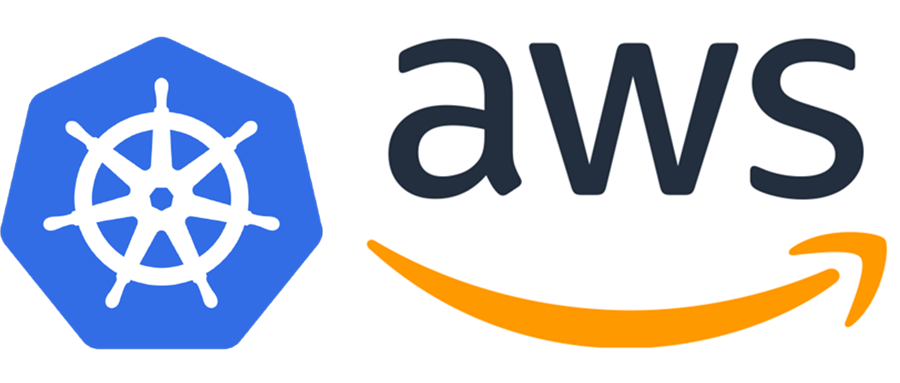

= AWS Workshop for Kubernetes

This is a self-paced workshop designed for Development and Operations teams who would like to leverage Kubernetes on Amazon Web Services (AWS).

This workshop provides instructions to create, manage, and scale a Kubernetes cluster on AWS, as well as how to deploy applications, scale them, run stateless and stateful containers, perform service discovery between different microservices, and other similar concepts.

It also shows deep integration with several AWS technologies.

== Paths

There are two main paths. Each path should take approximately 4 hours to complete. 
- link:developer-path.adoc[For Developers or Development Teams]
- link:operations-path.adoc[For Operations Engineers or Operations Teams]

For those looking for a more condensed introduction to Kubernetes on AWS, there is also a link:combined-path.adoc[Combined Version], which should take approximately 2 hours to complete.

NOTE: You will incur charges as you go through these workshop guides as it will exceed the link:http://docs.aws.amazon.com/awsaccountbilling/latest/aboutv2/free-tier-limits.html[limits of AWS free tier]. An estimate of charges (<$20/day) can be seen at this link:https://calculator.s3.amazonaws.com/index.html#r=FRA&s=EC2&key=calc-E6DBD6F1-C45D-4827-93F8-D9B18C5994B0[simple monthly calculator]
